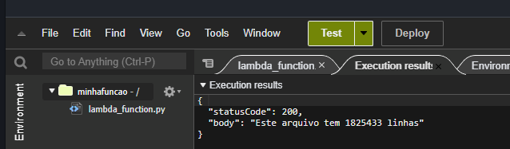

### Primeiro bucket de teste

### Segundo bucket  
Bucket para armazenar informações do Dockerfile
  

### Interface dos buckets  
Interface do Lambda exibindo a quantidade e nome dos buckets criados durante o exercício
  

#### Código Lambda    
Result do código  
  

### Função Lambda  
Interface com a função do Lambda funcionando
