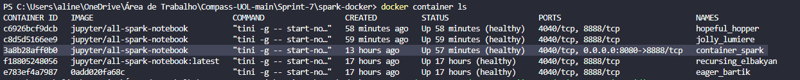

## Comandos

### Powershell 
#### baixando o arquivo README.md
cd 'C:\Users\aline\OneDrive\Área de Trabalho\Compass-UOL-main\Sprint-7\spark-docker'   

*substituição do wget pelo invoke-webequest para baixar o README*   
Invoke-WebRequest -Uri "" -Headers @{"Authorization"="token"} -OutFile README.md  

#

### Terminal Docker
#### configurando a imagem e criando o contêiner
docker pull jupyter/all-spark-notebook   

docker run -it -p 8080:8888 --name container_spark jupyter/all-spark-notebook   

*copiar o readme para dentro do conteiner (depois de baixar)*  
docker cp README.md 3a8b28aff0b0:/home/jovyan     

#

### Terminal do Container
#### verificando se o README se encontra no contêiner
ls  
exibido README.md e work  
pwd  
exibido /home/jovyan  

#

### Terminal Spark
#### fazendo a contagem de palavras do README
docker exec -it container_spark pyspark 

from pyspark.sql.functions import explode, split

lines = spark.read.text("/home/jovyan/README.md")  

*confirmando se o readme aparece*    
lines.show(truncate=False)  

*separando linhas por palavras*  
palavras = lines.select(explode(split(lines.value, '\s+')).alias('palavra')) 

*contagem de ocorrência*  
contagem_palavras  = palavras.groupBy('palavra').count()  

contagem_palavras.show(truncate=False) 

*resultado*  

*ordenar as palavras, mais frequente pra menos frequentes*  
ordem = contagem_palavras.orderBy('count', ascending=False) 

ordem.show(50, truncate=False)  
*resultado*  
  

#
