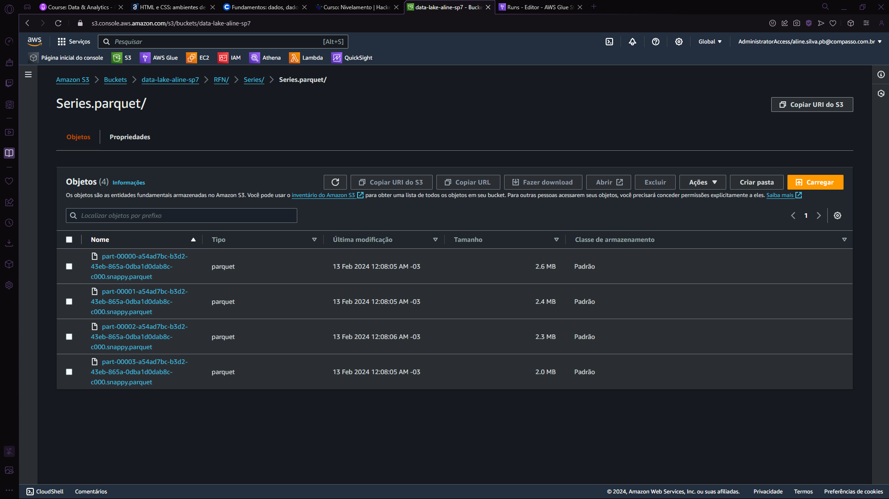

### Scripts Trusted
#### CSV
``` from awsglue.context import GlueContext
from pyspark.context import SparkContext
from awsglue.job import Job
import sys
from awsglue.utils import getResolvedOptions

## @params: [JOB_NAME]
args = getResolvedOptions(sys.argv, ['JOB_NAME'])

sc = SparkContext()
glueContext = GlueContext(sc)
spark = glueContext.spark_session
job = Job(glueContext)
job.init(args['JOB_NAME'], args)

movies_df = spark.read.csv("s3://data-lake-aline-sp7/Raw/Local/CSV/Movies/2024/01/23/movies.csv", header=True, inferSchema=True)
movies_df.write.parquet("s3://data-lake-aline-sp7/TRT/Movies/Movies.parquet", mode="overwrite")

series_df = spark.read.csv("s3://data-lake-aline-sp7/Raw/Local/CSV/Series/2024/01/23/series.csv", header=True, inferSchema=True)
series_df.write.parquet("s3://data-lake-aline-sp7/TRT/Series/Series.parquet", mode="overwrite")

job.commit() 
```
   
   

#### JSON   
``` import sys
from awsglue.context import GlueContext
from pyspark.context import SparkContext
from awsglue.job import Job
from pyspark.sql.functions import current_date
from pyspark.sql import SparkSession
from pyspark.sql.types import StructType, StructField, StringType, FloatType, IntegerType, DateType
from awsglue.utils import getResolvedOptions

## @params: [JOB_NAME]
args = getResolvedOptions(sys.argv, ['JOB_NAME'])

sc = SparkContext()
glueContext = GlueContext(sc)
spark = glueContext.spark_session
job = Job(glueContext)
job.init(args['JOB_NAME'], args)

input_path = "s3://data-lake-aline-sp7/Raw/tmdb/json/2024/01/31/*"
output_path = "s3://data-lake-aline-sp7/TRT/tmdb/"

spark = SparkSession.builder.getOrCreate()

schema = StructType([
    StructField("id", IntegerType(), True),
    StructField("title", StringType(), True),
    StructField("vote_average", FloatType(), True),
    StructField("vote_count", IntegerType(), True),
    StructField("release_date", DateType(), True),
    StructField("popularity", FloatType(), True)
])

tmdb_df = spark.read.schema(schema).json(input_path)
tmdb_df = tmdb_df.withColumn("dt", current_date())
tmdb_df.write.partitionBy("dt").parquet(output_path, mode="overwrite")

job.commit()

```


#

### Scripts Refined   

#### TMDB
```
import sys
from awsglue.context import GlueContext
from pyspark.context import SparkContext
from awsglue.job import Job
from pyspark.sql.functions import current_date
from pyspark.sql import SparkSession
from pyspark.sql.types import StructType, StructField, StringType, FloatType, IntegerType, DateType
from awsglue.utils import getResolvedOptions

## @params: [JOB_NAME]
args = getResolvedOptions(sys.argv, ['JOB_NAME'])

sc = SparkContext()
glueContext = GlueContext(sc)
spark = glueContext.spark_session
job = Job(glueContext)
job.init(args['JOB_NAME'], args)

input_path = "s3://data-lake-aline-sp7/TRT/tmdb/dt=2024-02-12/*"
output_path = "s3://data-lake-aline-sp7/RFN/tmdb/"


spark = SparkSession.builder.getOrCreate()
tmdb_df = spark.read.parquet(input_path)
tmdb_df = tmdb_df.withColumn("dt", current_date())
tmdb_df.write.partitionBy("dt").parquet(output_path, mode="overwrite")

job.commit()

```

#### CSVs   

```
import sys
from awsglue.context import GlueContext
from pyspark.context import SparkContext
from awsglue.job import Job
from pyspark.sql.functions import col
from awsglue.utils import getResolvedOptions

## @params: [JOB_NAME]
args = getResolvedOptions(sys.argv, ['JOB_NAME'])

sc = SparkContext()
glueContext = GlueContext(sc)
spark = glueContext.spark_session
job = Job(glueContext)
job.init(args['JOB_NAME'], args)

input_path_series = "s3://data-lake-aline-sp7/TRT/Series/Series.parquet/*"
output_path_series = "s3://data-lake-aline-sp7/RFN/Series/Series.parquet/"

series_df = spark.read.option("header", "true").csv(input_path_series)

columns_to_drop = ["tituloOriginal", "anoTermino", "tempoMinutos", "personagem", 
                   "nomeArtista", "anoNascimento", "anoFalecimento", "profissao", "titulosMaisConhecidos"]
series_df = series_df.drop(*columns_to_drop)

series_df.write.mode("overwrite").parquet(output_path_series)

job.commit()

```

  
  
  
  
  