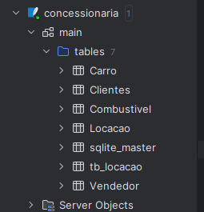

## Queries  

### criando tabelas separadas pra cada tipo de dado  
CREATE TABLE Clientes (  
    idCliente INTEGER PRIMARY KEY,  
    nomeCliente VARCHAR,  
    cidadeCliente VARCHAR,  
    estadoCliente VARCHAR,  
    paisCliente VARCHAR  
);  

CREATE TABLE Vendedor (  
    idVendedor INTEGER PRIMARY KEY,  
    nomeVendedor VARCHAR,  
    sexoVendedor VARCHAR,  
    estadoVendedor VARCHAR  
);  

CREATE TABLE Carro (  
    idCarro INTEGER PRIMARY KEY,  
    kmCarro INTEGER,  
    classiCarro VARCHAR,  
    marcaCarro VARCHAR,  
    modeloCarro VARCHAR,  
    anoCarro INTEGER,  
    idCombustivel INTEGER, -- Adiciona a coluna idCombustivel  
    FOREIGN KEY (idCombustivel) REFERENCES Combustivel(idCombustivel)  
);  

CREATE TABLE Combustivel (  
    idcombustivel INTEGER PRIMARY KEY,  
    tipoCombustivel VARCHAR  
);  

CREATE TABLE Locacao (  
    idLocacao INTEGER PRIMARY KEY,  
    dataLocacao DATE,  
    horaLocacao TIME,  
    qtdDiaria INTEGER,  
    vlrDiaria DECIMAL,  
    dataEntrega DATE,  
    horaEntrega TIME,  
    idCliente INTEGER,  
    idVendedor INTEGER,  
    idCarro INTEGER,  
    idcombustivel INTEGER,  
    FOREIGN KEY (idCliente) REFERENCES Clientes(idCliente),  
    FOREIGN KEY (idVendedor) REFERENCES Vendedor(idVendedor),  
    FOREIGN KEY (idCarro) REFERENCES Carro(idCarro),  
  
);  

#

### colocando dados da tb_locacao nas tables separadas    
INSERT OR IGNORE INTO Clientes (idCliente, nomeCliente, cidadeCliente, estadoCliente, paisCliente)  
SELECT DISTINCT idCliente, nomeCliente, cidadeCliente, estadoCliente, paisCliente
FROM main.tb_locacao;    

INSERT OR IGNORE INTO Vendedor (idVendedor, nomeVendedor, sexoVendedor, estadoVendedor)  
SELECT DISTINCT idVendedor, nomeVendedor, sexoVendedor, estadoVendedor
FROM main.tb_locacao;  

INSERT OR IGNORE INTO Carro (idCarro, kmCarro, classiCarro, marcaCarro, modeloCarro, anoCarro, idcombustivel)  
SELECT DISTINCT idCarro, kmCarro, classiCarro, marcaCarro, modeloCarro, anoCarro, idcombustivel  
FROM main.tb_locacao;  

INSERT OR IGNORE INTO Combustivel (idcombustivel, tipoCombustivel)  
SELECT DISTINCT idcombustivel, tipoCombustivel  
FROM main.tb_locacao;  

INSERT OR IGNORE INTO Locacao (idLocacao, dataLocacao, horaLocacao, qtdDiaria, vlrDiaria, dataEntrega, horaEntrega, idCliente, idVendedor, idCarro)  
SELECT DISTINCT  
    idLocacao,  
    dataLocacao,  
    horaLocacao,  
    qtdDiaria,  
    vlrDiaria,  
    dataEntrega,  
    horaEntrega,  
    idCliente,  
    idVendedor,  
    idCarro  
FROM main.tb_locacao;    

